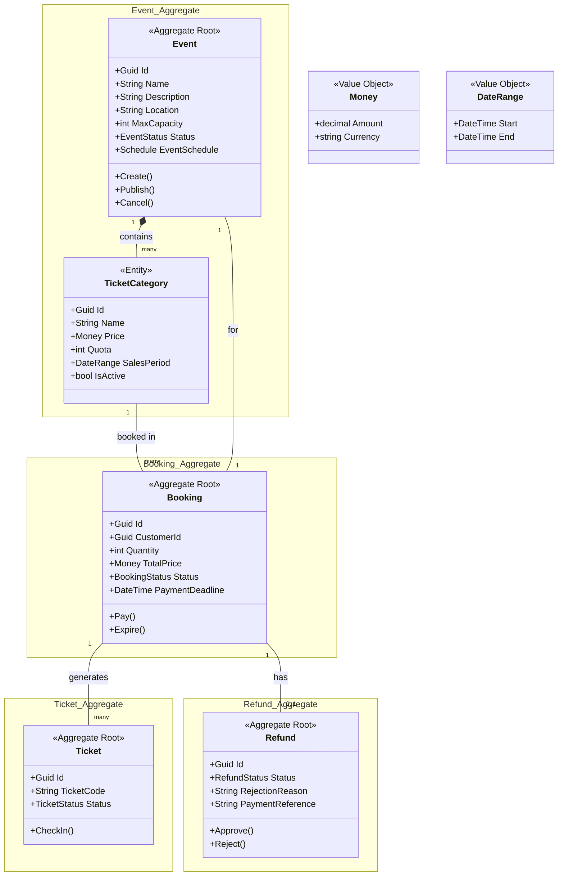

# Event-Management-System

## 1. Business Rules

### Event Rules

- End date must be after start date
- Maximum capacity must be greater than zero
- New event status always starts as Draft
- Can only be published if it has at least one active ticket category
- Total ticket quota across all categories must not exceed max capacity
- Only Draft → Published transition is allowed (not from Cancelled)
- Only Published → Cancelled transition is allowed (not from Completed)
- Cancelling an event marks all paid bookings as requiring refund

### Ticket Category Rules

- Price cannot be negative
- Quota must be greater than zero
- Sales end date must be before or on the event start date
- Total quota of all categories must not exceed event capacity
- Disabled category is kept for historical purposes but cannot be purchased

### Booking Rules

- Can only be created for a Published event with an active ticket category
- Booking must be within the sales period
- Quantity must be greater than zero and not exceed remaining quota
- A customer can have at most one active booking per event
- New booking status is always PendingPayment
- Payment deadline is 15 minutes after creation
- Expired booking releases its reserved quota

### Payment Rules

- Payment only allowed on PendingPayment bookings
- Payment not allowed after payment deadline
- Payment amount must exactly match total booking price
- After payment: status becomes Paid and unique ticket codes are issued

### Check-in Rules

- Ticket must be Active to be checked in
- Check-in only allowed for the matching event
- Check-in only allowed on the event day / within allowed window
- Already checked-in ticket cannot be used again

### Refund Rules

- Refund only for Paid bookings
- Cannot request refund if any ticket is already CheckedIn
- Must be before refund deadline (unless event was cancelled)
- Approval: tickets → Cancelled, booking → Refunded
- Rejection requires a rejection reason; booking and tickets unchanged
- PaidOut status is terminal — cannot be changed again

## 2. Initial Domain Model Draft

## 3. Initial Ubiquitous Language Glossary

This glossary ensures that both technical and domain experts use a shared vocabulary throughout the project.

| Term | Meaning |
| :--- | :--- |
| **Event** | An activity organized by an Event Organizer and attended by customers. |
| **Event Organizer** | A user who creates and manages events. |
| **Customer** | A user who books and purchases tickets. |
| **Gate Officer** | A user who validates tickets during event check-in. |
| **Ticket Category** | A type of ticket, such as Regular, VIP, or Early Bird. |
| **Quota** | The maximum number of tickets available in a ticket category. |
| **Booking** | A temporary reservation before payment is completed. |
| **Pending Payment** | A booking status indicating that payment has not been completed. |
| **Paid** | A booking status indicating that payment has been completed. |
| **Expired** | A booking status indicating that the payment deadline has passed. |
| **Ticket** | Proof of attendance generated after a booking is paid. |
| **Ticket Code** | A unique code used to identify and validate a ticket. |
| **Check-in** | The process of validating a ticket when a participant enters the event venue. |
| **Refund** | The process of returning money to a customer. |
| **Money** | A value object representing an amount and currency. |
| **Sales Period** | The period during which a ticket category can be purchased. |
| **Payment Deadline** | The deadline for completing payment after a booking is created. |